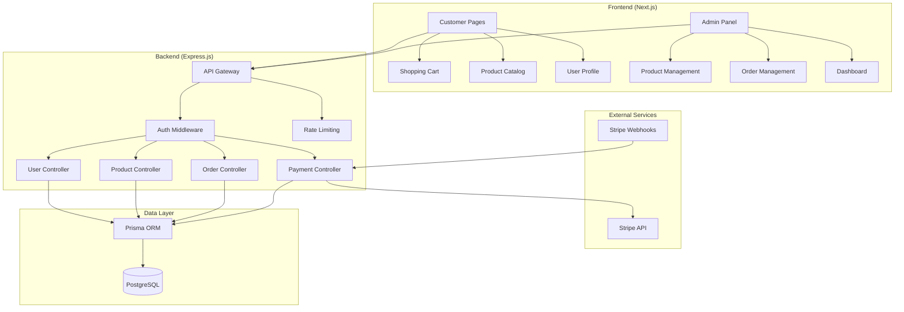

# Design Document: E-commerce Platform

## Overview

The e-commerce platform is a full-stack web application built with Next.js frontend and Express.js backend, designed for production use. The system follows a RESTful API architecture with JWT-based authentication, Stripe payment processing, and PostgreSQL data persistence. The application supports both customer-facing features (product browsing, cart management, order placement) and administrative functions (product management, order processing, user administration).

## Architecture

### System Architecture



### Technology Stack

- **Frontend**: Next.js 14 (App Router), TypeScript, Tailwind CSS
- **Backend**: Node.js, Express.js, TypeScript
- **Database**: PostgreSQL with Prisma ORM
- **Authentication**: JWT (access + refresh tokens), bcrypt
- **Payments**: Stripe API with webhook integration
- **Deployment**: Docker containers with environment configuration

## Components and Interfaces

### Frontend Components Structure

```
src/
├── app/
│   ├── (auth)/
│   │   ├── login/page.tsx
│   │   └── register/page.tsx
│   ├── (shop)/
│   │   ├── products/
│   │   │   ├── page.tsx
│   │   │   └── [id]/page.tsx
│   │   ├── cart/page.tsx
│   │   ├── checkout/page.tsx
│   │   └── orders/page.tsx
│   ├── (admin)/
│   │   ├── dashboard/page.tsx
│   │   ├── products/page.tsx
│   │   ├── orders/page.tsx
│   │   └── users/page.tsx
│   └── profile/page.tsx
├── components/
│   ├── ui/
│   │   ├── Button.tsx
│   │   ├── Input.tsx
│   │   ├── Modal.tsx
│   │   └── Table.tsx
│   ├── auth/
│   │   ├── LoginForm.tsx
│   │   └── RegisterForm.tsx
│   ├── product/
│   │   ├── ProductCard.tsx
│   │   ├── ProductList.tsx
│   │   └── ProductFilter.tsx
│   ├── cart/
│   │   ├── CartItem.tsx
│   │   └── CartSummary.tsx
│   └── admin/
│       ├── ProductForm.tsx
│       ├── OrderTable.tsx
│       └── Dashboard.tsx
├── lib/
│   ├── api.ts
│   ├── auth.ts
│   ├── stripe.ts
│   └── utils.ts
└── types/
    ├── user.ts
    ├── product.ts
    ├── order.ts
    └── api.ts
```

### Backend API Structure

```
src/
├── controllers/
│   ├── authController.ts
│   ├── userController.ts
│   ├── productController.ts
│   ├── orderController.ts
│   └── paymentController.ts
├── middleware/
│   ├── auth.ts
│   ├── validation.ts
│   ├── rateLimit.ts
│   └── errorHandler.ts
├── routes/
│   ├── auth.ts
│   ├── users.ts
│   ├── products.ts
│   ├── orders.ts
│   └── payments.ts
├── services/
│   ├── authService.ts
│   ├── productService.ts
│   ├── orderService.ts
│   └── paymentService.ts
├── utils/
│   ├── jwt.ts
│   ├── validation.ts
│   └── logger.ts
└── prisma/
    ├── schema.prisma
    └── migrations/
```

### Core Interfaces

```typescript
// User Types
interface User {
  id: string;
  email: string;
  name: string;
  role: 'USER' | 'ADMIN';
  address?: string;
  createdAt: Date;
  updatedAt: Date;
}

// Product Types
interface Product {
  id: string;
  name: string;
  description: string;
  price: number;
  stock: number;
  categoryId: string;
  images: string[];
  discount?: number;
  createdAt: Date;
  updatedAt: Date;
}

interface Category {
  id: string;
  name: string;
  description?: string;
  products: Product[];
}

// Cart Types
interface CartItem {
  id: string;
  productId: string;
  quantity: number;
  userId: string;
  product: Product;
}

// Order Types
interface Order {
  id: string;
  userId: string;
  status: 'PENDING' | 'PAID' | 'SHIPPED' | 'DELIVERED' | 'CANCELLED';
  total: number;
  paymentIntentId?: string;
  items: OrderItem[];
  createdAt: Date;
  updatedAt: Date;
}

interface OrderItem {
  id: string;
  orderId: string;
  productId: string;
  quantity: number;
  price: number;
  product: Product;
}
```

## Data Models

### Database Schema (Prisma)

```prisma
generator client {
  provider = "prisma-client-js"
}

datasource db {
  provider = "postgresql"
  url      = env("DATABASE_URL")
}

model User {
  id        String   @id @default(cuid())
  email     String   @unique
  name      String
  password  String
  role      Role     @default(USER)
  address   String?
  createdAt DateTime @default(now())
  updatedAt DateTime @updatedAt
  
  orders    Order[]
  cartItems CartItem[]
  
  @@map("users")
}

model Category {
  id          String    @id @default(cuid())
  name        String    @unique
  description String?
  createdAt   DateTime  @default(now())
  updatedAt   DateTime  @updatedAt
  
  products Product[]
  
  @@map("categories")
}

model Product {
  id          String   @id @default(cuid())
  name        String
  description String
  price       Decimal  @db.Decimal(10, 2)
  stock       Int
  images      String[]
  discount    Decimal? @db.Decimal(5, 2)
  categoryId  String
  createdAt   DateTime @default(now())
  updatedAt   DateTime @updatedAt
  
  category   Category    @relation(fields: [categoryId], references: [id])
  cartItems  CartItem[]
  orderItems OrderItem[]
  
  @@index([categoryId])
  @@index([name])
  @@map("products")
}

model CartItem {
  id        String   @id @default(cuid())
  userId    String
  productId String
  quantity  Int
  createdAt DateTime @default(now())
  updatedAt DateTime @updatedAt
  
  user    User    @relation(fields: [userId], references: [id], onDelete: Cascade)
  product Product @relation(fields: [productId], references: [id], onDelete: Cascade)
  
  @@unique([userId, productId])
  @@map("cart_items")
}

model Order {
  id              String      @id @default(cuid())
  userId          String
  status          OrderStatus @default(PENDING)
  total           Decimal     @db.Decimal(10, 2)
  paymentIntentId String?
  createdAt       DateTime    @default(now())
  updatedAt       DateTime    @updatedAt
  
  user  User        @relation(fields: [userId], references: [id])
  items OrderItem[]
  
  @@index([userId])
  @@index([status])
  @@map("orders")
}

model OrderItem {
  id        String  @id @default(cuid())
  orderId   String
  productId String
  quantity  Int
  price     Decimal @db.Decimal(10, 2)
  
  order   Order   @relation(fields: [orderId], references: [id], onDelete: Cascade)
  product Product @relation(fields: [productId], references: [id])
  
  @@map("order_items")
}

enum Role {
  USER
  ADMIN
}

enum OrderStatus {
  PENDING
  PAID
  SHIPPED
  DELIVERED
  CANCELLED
}
```

### API Endpoints

#### Authentication Endpoints

```typescript
// POST /api/auth/register
interface RegisterRequest {
  email: string;
  password: string;
  name: string;
}

interface AuthResponse {
  user: User;
  accessToken: string;
  refreshToken: string;
}

// POST /api/auth/login
interface LoginRequest {
  email: string;
  password: string;
}

// POST /api/auth/refresh
interface RefreshRequest {
  refreshToken: string;
}

// POST /api/auth/logout
// Requires: Authorization header
```

#### Product Endpoints

```typescript
// GET /api/products
interface ProductsQuery {
  page?: number;
  limit?: number;
  search?: string;
  categoryId?: string;
  sortBy?: 'name' | 'price' | 'createdAt';
  sortOrder?: 'asc' | 'desc';
}

interface ProductsResponse {
  products: Product[];
  pagination: {
    page: number;
    limit: number;
    total: number;
    totalPages: number;
  };
}

// GET /api/products/:id
interface ProductResponse {
  product: Product & { category: Category };
}

// POST /api/products (Admin only)
interface CreateProductRequest {
  name: string;
  description: string;
  price: number;
  stock: number;
  categoryId: string;
  images: string[];
  discount?: number;
}

// PUT /api/products/:id (Admin only)
// DELETE /api/products/:id (Admin only)
```

#### Cart Endpoints

```typescript
// GET /api/cart
interface CartResponse {
  items: (CartItem & { product: Product })[];
  total: number;
}

// POST /api/cart/items
interface AddToCartRequest {
  productId: string;
  quantity: number;
}

// PUT /api/cart/items/:id
interface UpdateCartItemRequest {
  quantity: number;
}

// DELETE /api/cart/items/:id
```

#### Order Endpoints

```typescript
// GET /api/orders
interface OrdersResponse {
  orders: (Order & { items: (OrderItem & { product: Product })[] })[];
}

// GET /api/orders/:id
interface OrderResponse {
  order: Order & { items: (OrderItem & { product: Product })[] };
}

// POST /api/orders
interface CreateOrderRequest {
  items: { productId: string; quantity: number }[];
}

// PUT /api/orders/:id/status (Admin only)
interface UpdateOrderStatusRequest {
  status: OrderStatus;
}
```

#### Payment Endpoints

```typescript
// POST /api/payments/create-intent
interface CreatePaymentIntentRequest {
  orderId: string;
}

interface CreatePaymentIntentResponse {
  clientSecret: string;
  paymentIntentId: string;
}

// POST /api/payments/webhook
// Stripe webhook endpoint for payment status updates
```

#### Admin Endpoints

```typescript
// GET /api/admin/dashboard
interface DashboardResponse {
  stats: {
    totalUsers: number;
    totalOrders: number;
    totalRevenue: number;
    recentOrders: Order[];
  };
}

// GET /api/admin/users
interface UsersResponse {
  users: User[];
  pagination: PaginationInfo;
}

// GET /api/admin/orders
interface AdminOrdersResponse {
  orders: (Order & { user: User; items: (OrderItem & { product: Product })[] })[];
  pagination: PaginationInfo;
}
```

## Correctness Properties

*A property is a characteristic or behavior that should hold true across all valid executions of a system—essentially, a formal statement about what the system should do. Properties serve as the bridge between human-readable specifications and machine-verifiable correctness guarantees.*

### Property 1: User Registration Security
*For any* valid user registration data (email, password, name), the system should create a user account where the stored password is a bcrypt hash and never the original plaintext password.
**Validates: Requirements 1.1, 1.5**

### Property 2: Authentication Token Generation
*For any* valid login credentials, successful authentication should always return both access and refresh JWT tokens that can be verified and contain the correct user information.
**Validates: Requirements 1.2, 1.6**

### Property 3: Session Invalidation
*For any* authenticated user session, after logout the previously issued tokens should be invalid and rejected by protected endpoints.
**Validates: Requirements 1.3**

### Property 4: Invalid Credential Rejection
*For any* invalid login credentials (wrong email, wrong password, or malformed data), the authentication attempt should be rejected with an appropriate error response.
**Validates: Requirements 1.4**

### Property 5: Role-Based Access Control
*For any* user with admin role, they should have access to admin endpoints, and for any user with regular role, admin endpoints should be denied.
**Validates: Requirements 1.7, 7.1**

### Property 6: Product Search Accuracy
*For any* search query, all returned products should contain the search terms in either their name or description fields.
**Validates: Requirements 2.2**

### Property 7: Category Filtering Correctness
*For any* category filter applied, all returned products should belong to the specified category and no products from other categories should be included.
**Validates: Requirements 2.3**

### Property 8: Product Information Completeness
*For any* product displayed, the response should include all required fields: name, description, price, stock quantity, images, and category information.
**Validates: Requirements 2.4, 2.6**

### Property 9: Cart Item Management
*For any* cart operation (add, update, remove), the cart contents should accurately reflect the changes and maintain correct item quantities and product associations.
**Validates: Requirements 3.1, 3.2, 3.3**

### Property 10: Cart Total Calculation
*For any* cart with items, the total price should equal the sum of (item price × quantity) for all items, including any applicable discounts.
**Validates: Requirements 3.4**

### Property 11: Cart Persistence
*For any* logged-in user, cart contents should remain consistent across different sessions and browser instances.
**Validates: Requirements 3.5**

### Property 12: Stock Validation
*For any* cart operation, the system should prevent adding quantities that exceed available product stock.
**Validates: Requirements 3.7**

### Property 13: Order Creation Integrity
*For any* checkout operation, the created order should contain exactly the items from the user's cart with correct quantities and prices at the time of order creation.
**Validates: Requirements 4.1**

### Property 14: Payment Success Handling
*For any* successful payment, the order status should be updated to 'PAID' and product stock quantities should be reduced by the ordered amounts.
**Validates: Requirements 4.3**

### Property 15: Payment Failure Handling
*For any* failed payment, the order should remain in 'PENDING' status and product stock should not be modified.
**Validates: Requirements 4.4**

### Property 16: Order Status Transitions
*For any* order, status changes should follow the valid state machine: PENDING → PAID → SHIPPED → DELIVERED, with CANCELLED being reachable from any state except DELIVERED.
**Validates: Requirements 4.5**

### Property 17: Order History Privacy
*For any* user requesting order history, they should only receive orders that belong to them and never see orders from other users.
**Validates: Requirements 4.6, 6.3**

### Property 18: Unique Order Identifiers
*For any* two orders created by the system, they should have different unique identifiers.
**Validates: Requirements 4.7**

### Property 19: Webhook Authentication
*For any* incoming webhook request, only requests with valid Stripe signatures should be processed, and invalid signatures should be rejected.
**Validates: Requirements 5.6**

### Property 20: Payment Reference Storage
*For any* completed payment, the system should store the payment transaction ID and associate it with the correct order.
**Validates: Requirements 5.7**

### Property 21: Profile Information Security
*For any* user accessing their profile, they should only see their own information and never data from other users.
**Validates: Requirements 6.1**

### Property 22: Profile Update Validation
*For any* profile update request, invalid data should be rejected and valid data should be saved while maintaining data integrity constraints.
**Validates: Requirements 6.2, 6.5**

### Property 23: Admin Product Management
*For any* admin user, they should be able to create, read, update, and delete products, while regular users should be denied these operations.
**Validates: Requirements 7.2**

### Property 24: Admin Order Management
*For any* admin user, they should be able to view all orders and update order statuses, while regular users should only see their own orders.
**Validates: Requirements 7.4, 7.5**

### Property 25: Rate Limiting Protection
*For any* client making requests, when the rate limit is exceeded, subsequent requests should be rejected with appropriate rate limit error responses.
**Validates: Requirements 8.1**

### Property 26: Input Validation Security
*For any* API endpoint receiving input data, malicious payloads (SQL injection, XSS, etc.) should be rejected and not processed.
**Validates: Requirements 8.2**

### Property 27: CSRF Protection
*For any* state-changing operation, requests without valid CSRF tokens should be rejected.
**Validates: Requirements 8.4**

### Property 28: Error Information Disclosure
*For any* error response, sensitive information (passwords, tokens, internal paths) should not be exposed in error messages.
**Validates: Requirements 8.6**

### Property 29: Authentication Enforcement
*For any* protected endpoint, requests without valid JWT tokens should be rejected with authentication errors.
**Validates: Requirements 8.7**

### Property 30: Data Referential Integrity
*For any* data operation involving related entities, referential integrity should be maintained (e.g., orders should always reference valid users and products).
**Validates: Requirements 9.2**

### Property 31: Concurrent Operation Safety
*For any* concurrent operations on the same data, the final state should be consistent and no data corruption should occur.
**Validates: Requirements 9.5**

### Property 32: Configuration Validation
*For any* system startup, missing required environment variables should cause startup failure with clear error messages.
**Validates: Requirements 10.3**

## Error Handling

### Error Response Format
All API errors follow a consistent format:
```typescript
interface ErrorResponse {
  error: {
    code: string;
    message: string;
    details?: any;
  };
  timestamp: string;
  path: string;
}
```

### Error Categories

1. **Authentication Errors (401)**
   - Invalid credentials
   - Expired tokens
   - Missing authentication

2. **Authorization Errors (403)**
   - Insufficient permissions
   - Role-based access denied

3. **Validation Errors (400)**
   - Invalid input data
   - Missing required fields
   - Format violations

4. **Resource Errors (404)**
   - Product not found
   - Order not found
   - User not found

5. **Business Logic Errors (422)**
   - Insufficient stock
   - Invalid order state transitions
   - Payment processing failures

6. **Rate Limiting Errors (429)**
   - Too many requests
   - API quota exceeded

7. **Server Errors (500)**
   - Database connection failures
   - External service unavailable
   - Unexpected system errors

### Error Handling Strategy

- **Graceful Degradation**: System continues operating when non-critical services fail
- **Retry Logic**: Automatic retries for transient failures with exponential backoff
- **Circuit Breaker**: Prevent cascading failures when external services are down
- **Logging**: Comprehensive error logging without exposing sensitive information
- **User Feedback**: Clear, actionable error messages for users

## Testing Strategy

### Dual Testing Approach

The testing strategy employs both unit testing and property-based testing as complementary approaches:

- **Unit Tests**: Verify specific examples, edge cases, and error conditions
- **Property Tests**: Verify universal properties across all inputs using randomized testing
- **Integration Tests**: Verify component interactions and API contracts
- **End-to-End Tests**: Verify complete user workflows

### Property-Based Testing Configuration

**Library Selection**: 
- Frontend: `fast-check` for TypeScript/JavaScript property testing
- Backend: `fast-check` for Node.js property testing

**Test Configuration**:
- Minimum 100 iterations per property test
- Each property test references its design document property
- Tag format: **Feature: ecommerce-platform, Property {number}: {property_text}**

### Unit Testing Focus Areas

**Specific Examples**:
- User registration with valid data
- Product creation with complete information
- Order checkout with multiple items
- Payment webhook processing

**Edge Cases**:
- Empty cart checkout attempts
- Duplicate email registration
- Invalid product ID references
- Expired token usage

**Error Conditions**:
- Network failures during payment processing
- Database connection losses
- Invalid webhook signatures
- Malformed API requests

### Integration Testing

**API Contract Testing**:
- Request/response schema validation
- Authentication flow testing
- Payment integration testing
- Database transaction testing

**Service Integration**:
- Stripe payment processing
- Email notification services
- File upload services
- Database operations

### Performance Testing

**Load Testing**:
- Concurrent user sessions
- High-volume product searches
- Simultaneous order processing
- Database query performance

**Stress Testing**:
- Rate limiting effectiveness
- Memory usage under load
- Database connection pooling
- Cache performance

### Security Testing

**Authentication Testing**:
- JWT token validation
- Password hashing verification
- Session management
- Role-based access control

**Input Validation Testing**:
- SQL injection prevention
- XSS attack prevention
- CSRF protection
- Rate limiting enforcement

### Test Data Management

**Test Database**:
- Separate test database instance
- Automated test data seeding
- Database cleanup between tests
- Migration testing

**Mock Services**:
- Stripe API mocking for payment tests
- Email service mocking
- File storage mocking
- External API mocking